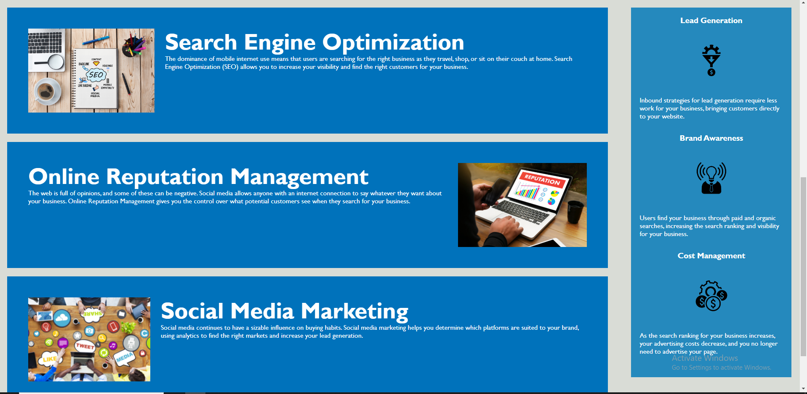

# Code Refactor Starter Code
# <Horiseon Social Solution Services>

## Description

Provide a short description explaining the what, why, and how of your project. Use the following questions as a guide:
My motivation for working on this project was to test myself to the limits and experience debugging and simplifying without the help of others through trial and error methods.
I built this project because it was a good way for me to try out what I have learned and see what ways work and what ways don't. I can trial and error the different ideas that I have and learn to understand why some work and why other's dont.
My problem here was to solve the issue of complexity in the code provided to me. It seemed like lots of repeated code was going on so I wanted to address as many issues as I could and make a website that runs on the least amount of code.
I learned how to combine many repetitive css codes together into one. In addition I was able to utilize flex displays to create a similar header area to the needs of the assignment. I also was able to learn to use the > to address images so that you could use the exact same class for everything but have it find the next available image and send additional styles to just the images afterwards. I was also able to look into how to anchor things through id. 

## Installation

I downloaded the code from urban-octo-telegram 

## Usage

For Horiseon Social Service I was tasked with optimizing and simplifying the html and css required for their website. I basically worked to decode the the style sheet and index.html to make sure that it is utilized in the most efficient way possible. I was able to do this mainly in the style.css where I combined many of the classes that were given to me in the starter code. 
I first began by changing the header section to become a flex display and worked with the padding and justify content to ensure that the box was still working in the same way as it should be.
I then checked all of the links and noticed that the link for search engine optimization wasn't being linked correctly so I used an ID and anchored it to the href.
Then I went into the style.css and saw that the section with the pictures and paragraphs were being repeated over 3 times for each of the picture boxes for both the sidebox as well as the main boxes. So then I knew that I needed to work on these two things separately.
For the main display I named the class "content" which would be all of the styles I wanted to add to this section. I then did another content class specifically for the images so that the images would still be held by the specification to have a max height of 200px.
Next I worked on the side bar div naming the class "benefit-all" to classify the div section for all of the side bar. I had to make a separate class for the images to make sure that the images are held by their properties correctly.
After this I checked the website from my index.html and it looked like this:

[Link to my github repository for challenge 1](https://figwheymutton.github.io/Horiseon/)

